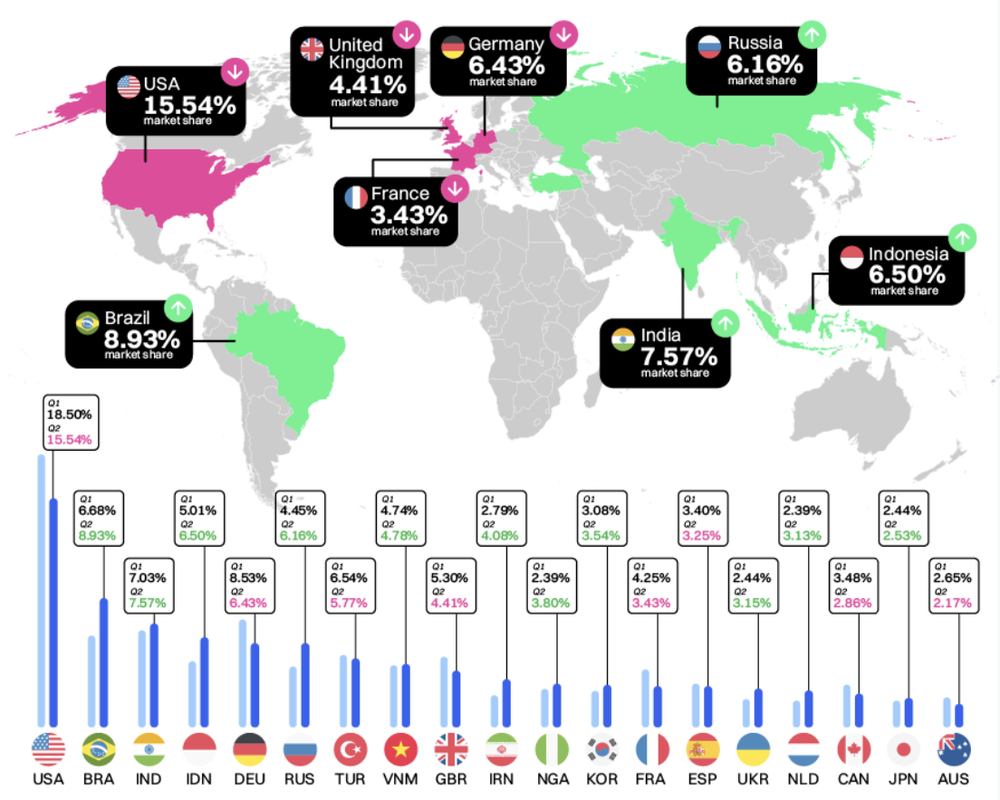
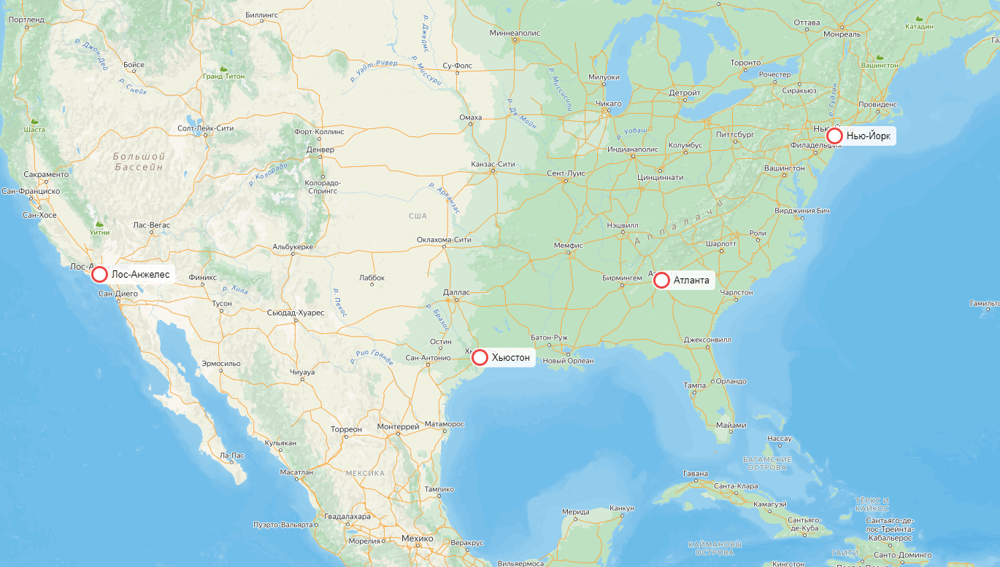
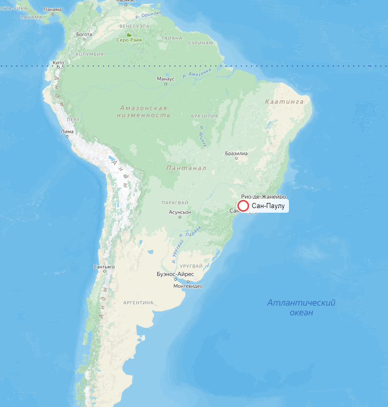
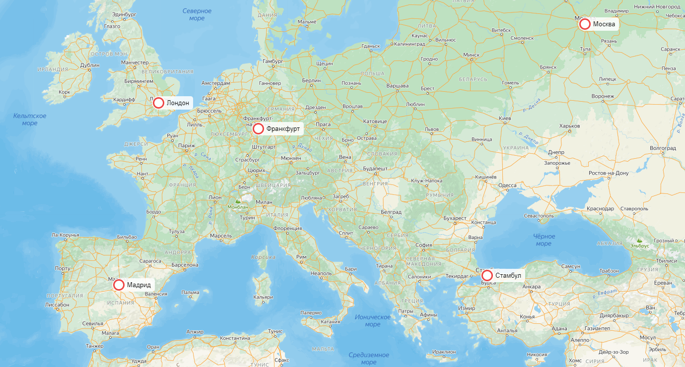
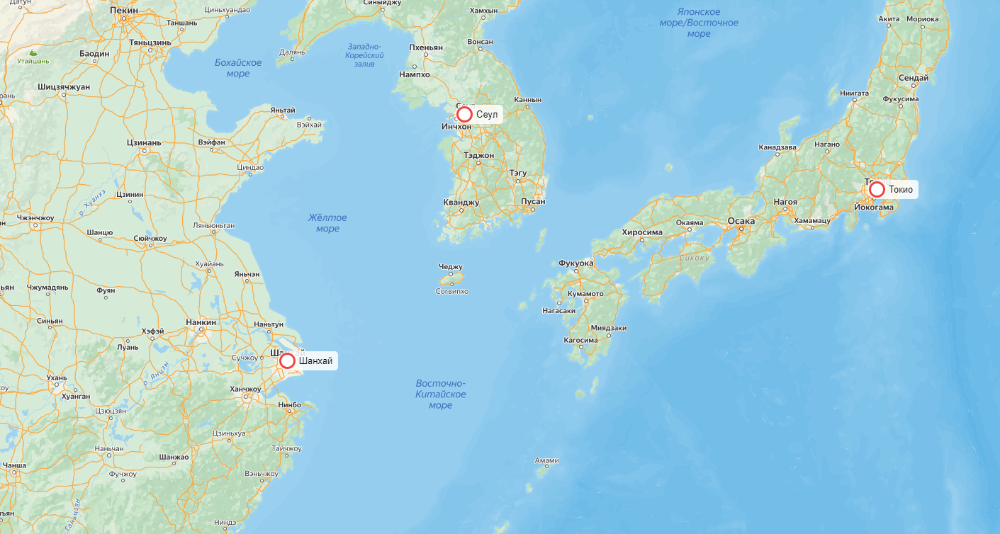
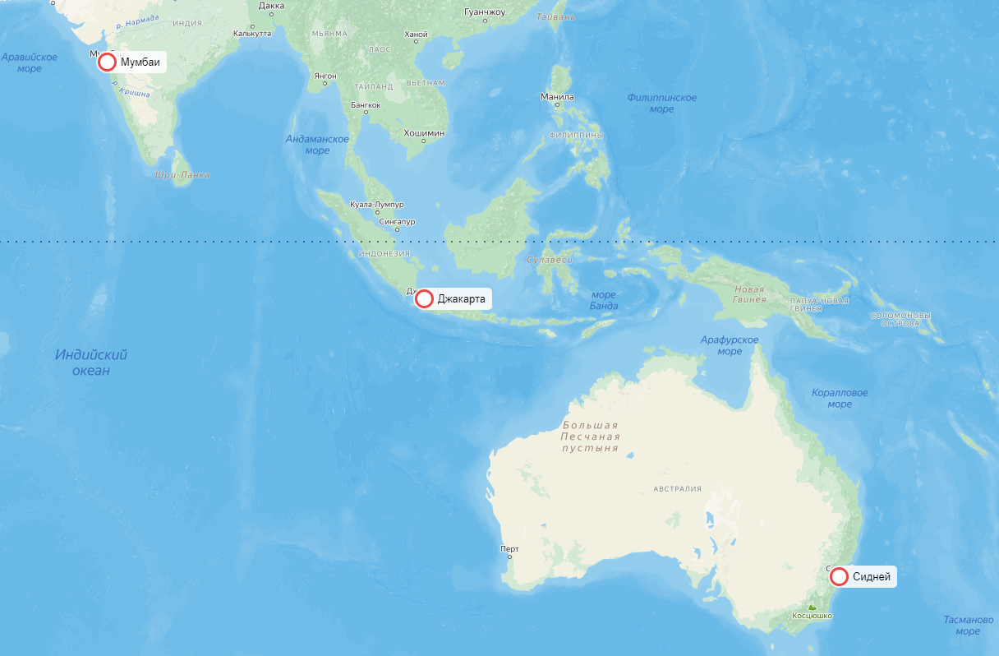
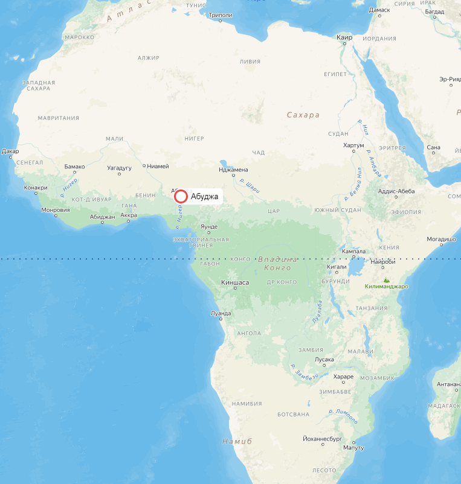
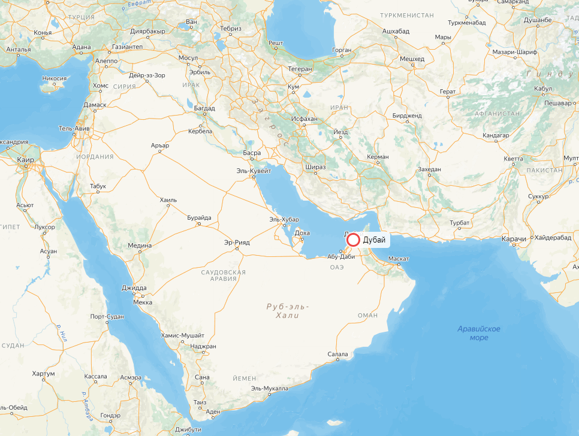
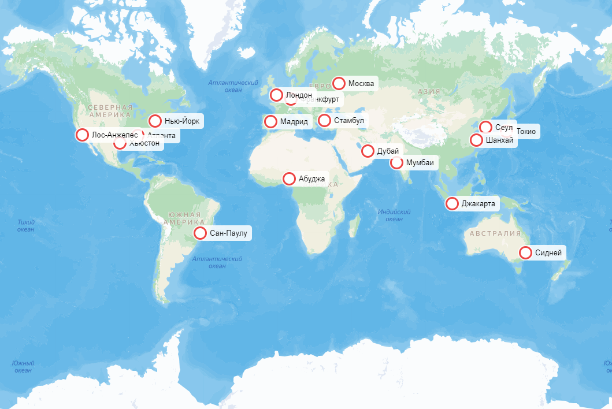
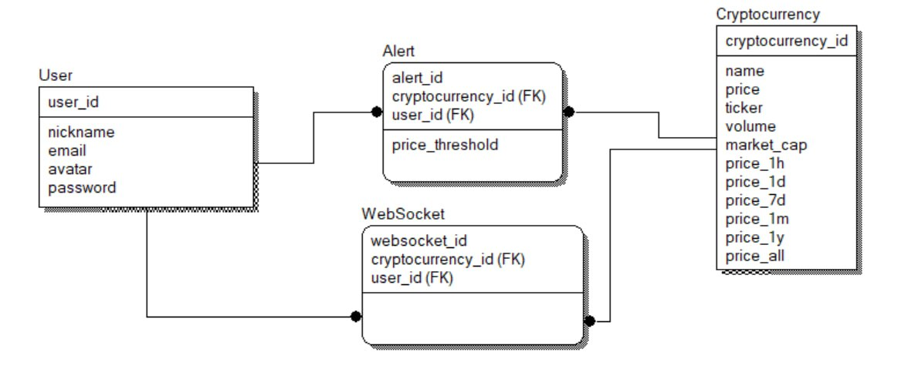

# Highload Coinmarketcap
Проект по курсу "Проектирование высоконагруженных систем" VK Education в МГТУ.

## 1. Тема и целевая аудитория 
**Coinmarketcap**  —  веб-сервис для отслеживания цен на криптовалютные активы.

### Ключевой функционал (MVP)
- Получение актуальных данных о ценах на криптовалюты
- Получение ранжированного списка криптовалют
- Получение исторических данных
- Получение уведомлений о достижении цены определённых значений
- Получение ранжированного списка криптобирж
- Получение аналитических данных

### Целевая аудитория
Веб-сервис имеет около 80 миллионов активных пользователей в месяц.
Данные о месячной аудитории по странам представлены в таблице.

| Страна    | Количество пользователей в месяц, млн |
| --------- | ------------------------------------- |
| США       | 22,26                                 |
| Бразилия  | 8,84                                  |
| Германия  | 8,31                                  |
| Индия     | 7,85                                  |
| Индонезия | 5,77                                  |

## 2. Расчет нагрузки

### Продуктовые метрики

По данным сайта [hypestat](https://hypestat.com/info/coinmarketcap.com) 

* Дневная аудитория(DAU) - 2.8 млн
* Месячная аудитория(MAU) - 85.2 млн

### Объем сохраняемых данных

В открытых источниках нет информации, сколько всего пользователей зарегистрировано в CoinmarketCap.
Но всего по данным на 2023 год владельцами криптовалют (то есть наиболее вероятными пользователями сервиса) являются 580 млн. человек.   Далеко не каждый из этих 580 млн. использует именно CoinmarketCap для отслеживания цен на криптовалюты.
Также стоит отметить, что даже незарегистрированным пользователям доступен практически полный функционал веб-сервиса. Регистрация по большей части нужна только наиболее активным пользователям криптовалют, которые совершаю достаточно много сделок, пытаясь спекулировать на цене, потому что регистрация даёт возможность получаения уведомлений об изменении цены. 
Из открытых источников мне не удалось узначать, какой процент пользователей заходит просто посмотреть на цену, а какой ещё и выставляет уведомления об изменении цен.
Поэтому в своих расчётах я буду опираться на свою экспертность в данном вопросе и возьму цифру в 50 млн зарегистрированных пользователей:

| хранимые данные           | средний размер         |  суммарный объем |
|---------------------------|------------------------|------------------|
| профиль пользователя      | 5  Кб                  |   250 Гб         | 

В профиль пользователя входят:
* Базовые данные профиля (имя, email, пароль, дата регистрации, соцсети, 2FA и т.д.)
* Перечать отслеживаемых криптовалют (уведомления об изменениии цены, хранение списка отслеживаемых криптовалют)

### Запросы пользователей в день и RPS

В открытых источниках мне не удалось найти данные о количестве различных действий пользователя в день. Поэтому я использовал данные сайта [hypestat](https://hypestat.com/info/coinmarketcap.com), согласно которым в день посещается 7 679 805 страниц или 2.73 страницы на пользователя в день

Предположительные данные по среднему количеству запросов пользователя представлены в таблице ниже. RPS можно вычислить по формуле: RPS = среднее_кол-во_действий_в_день * DAU / 86400

Я предполагаю, что пиковый RPS привязан к определённым событиям в криптомире и составляет до х100 от среднего
Для такого коэффициента существуют следующие обоснования:
1. Цена абсолютного большинства криптовалют в большей или меньшей степени кореллируют с биткоином. Биткоин в свою очередь коррелирует с фондовым рынком. 
2. Если посмотреть на исторические данные, то можно заметить, что на цену криптовалют влияют следующие факторы: денежно-кредитная политика, экономическая ситуация, геополитика, изменения в регулировании.

Из пунктов 1 и 2 следует, во-первых, что криптовалюты либо растут либо падают относительно синхронно, а, во-вторых, что это падение зачастую привязано к новостям по определённым темам. Соответственно в момент выхода таких новостей и будет наступать пиковый RPS за счёт того, что пользователи пойдут смотреть на цены, а также сервис начнёт отправлять уведомления большому числу пользователей.

| посещаемые страницы                               | среднее количество в день на пользователя | средний RPS  | пиковый RPS |
|---------------------------------------------------|:-----------------------------------------:|--------------|-------------|
| посещение главной страницы                        |                   1                       | 32           |  3200       |
| посещение страницы отдельно взятой криптовалюты   |                   1.7                     | 55           |  5500       |
| получение ранжированного списка криптобирж        |                   0.03                    | 1            |  100        |
| **Всего**                                         |                  **2.73**                 | **88**       |  **8800**   |

| действия на странице                              | среднее количество в день на пользователя | средний RPS  | пиковый RPS |
|---------------------------------------------------|:-----------------------------------------:|--------------|-------------|
| добавление в избранное \ удаление из избранного   |                   0.1                     | 3            |  300        |
| подписка на уведомлени \ отписка от уведомлений   |                   0.1                     | 3            |  300        |
| получение исторических данных                     |                   5                       | 162          |  16 200     |
| **Всего**                                         |                  **5.2**                  | **168**      |  **16 800** |

| websocket                                         | среднее количество в день на пользователя | средний RPS  | пиковый RPS   |
|---------------------------------------------------|:-----------------------------------------:|--------------|---------------|
| получение уведомления                             |                   10                      | 7            |  700          |
| получение изменений цены                          |                   86400                   | 56 000       |  1 400 000    |
| **Всего**                                         |                  **86410**                | **56 007**   | **1 400 700** |

Я исхожу из предположения, что только каждый 50-ый пользователь держит длительное время страницу открытой. Также стоит принимать во внимание, что подобного рода сервисы используют определеённую оптимизацию, переодически проверяя активность пользователя на странице. И если пользователь не пользуется страницей. То передача сообщений через Websocket приостонавливается, а возобновляется только в тот момент, когда пользователь вновь проявляет активность.  То есть только с 2% пользователей нужно единовременно держать активный Websocket - то есть с 140 тыс. пользователями.   Сообщения через web-socket отправляются в среднем ~60 раз в минуту. 
Я предполагаю, что в моменты пиковой нагрузки сообщения через websocket начинаю передаваться в несколько раз реже, например, в 4 раза реже.

### Сетевой трафик

Нагрузку на сеть можно расчитать по формуле: нагрузка[Гбит/c] = средний_трафик_на_действие * RPS * 8 / 1024 

| посещаемые страницы                              | средний трафик на одно действие | средняя нагрузка на сеть | пиковая нагрузка на сеть |
|--------------------------------------------------|---------------------------------|--------------------------|--------------------------|
| посещение главной страницы                       | 36.7 Кб                         | 9.2 Мбит/с               |  0.9 Гбит/с           |
| посещение страницы отдельно взятой криптовалюты  | 64.4 Кб                         | 16.1 Мбит/с              |  1.57 Гбит/c           |
| получение ранжированного списка криптобирж       | 22.2 Кб                         | 5.57 Мбит/с              |  0.54 Гбит/c              |
| **Всего**                                        |                                 | **30.9 Мбит/c**          |  **3.01 Гбит/c**       |

| действия на странице                              | средний трафик на одно действие           | средняя нагрузка на сеть  | пиковая нагрузка на сеть |
|---------------------------------------------------|:-----------------------------------------:|---------------------------|--------------------------|
| добавление в избранное \ удаление из избранного   |                   1 Кб                    | 24 Кбит/с                 |  2.34 Мбит/с             |
| подписка на уведомлени \ отписка от уведомлений   |                   1 Кб                    | 24 Кбит/с                 |  2.34 Мбит/с             |
| получение исторических данных                     |                   30 Кб                   | 720 Кбит/с                |  70.31 Мбит/с            |
| **Всего**                                         |                                           | **768 Кбит/с**            |  **75 Мбит/с**           |

| websocket                                         | средний трафик на одно действие           | средняя нагрузка на сеть  | пиковая нагрузка на сеть |
|---------------------------------------------------|:-----------------------------------------:|---------------------------|--------------------------|
| получение уведомления                             |                   1.6 Кб                  | 89.6 Кбит/с               |  8.75 Мбит/с             |
| получение изменений цены                          |                   0.4 Кб                  | 175 Мбит/с                |  17.1 Гбит/c             |
| **Всего**                                         |                                           | **175.01 Мбит/с**         | **17.1 Гбит/c**          |

Браузер не даёт посмотреть конкретные значения трафика, пересылаемые через WebSocket, но даёт посмотреть длину сообщения.
Берём вес одного символа в 1 байта. Среднее сообщение в 410 символов. Среднее число сообщений в минуту - 60.
Получается 24 Кб в минуту.

## 3. Глобальная балансировка нагрузки

### Обоснования расположения ЦОДов

В пункте [1. Тема и целевая аудитория](#1-тема-и-целевая-аудитория) приводилось географическое распределение аудитории CoinMarketCap.   При размещении ЦОДов также будем учитывать, что пиковая нагрузка может быть до 100 раз больше средней.

18-23% аудитории - это США и Канада, что в райно 25 млн MAU, поэтому в Северной Америке необходимо расположить несколько ЦОДов в городах с самым большим населением, которые будут распределены по площади страны. Также на США лучше не эконимать, поэтому лучше поставить ЦОДы поплотнее:

В Бразилии находится около 6-9% аудитории, что составляет ~9 млн. MAU. Несмотря на большую площадь страны, для начала достаточно разместить там 1 ЦОД на побережье Антлантики, поскольку всё население сосредоточено именно там, а население в Южной Америке не столь богатое, чтобы ставить ещё ЦОДы, так что задержка для них будет приемлемая:

32-37% аудитории - это Европа и прилегающие страны, что в райно 40 млн MAU. Население здесь тоже достаточно обеспеченное, и присутствует необходимая инфраструктура, так что можно поставить побольше ЦОД:

7% аудитории - это Корея и Япония. Данные страны относятся к развитыми, соответсвенно на них тоже не стоить экономить, и лучше поставитьв каждой по ЦОД. Также на всякий случай можно поставить ЦОД в Шанхае, чтобы перенаправлять туда китайских пользователей, обходящих местные блокировки.

Криптовалюты пользуются большой популятностью в Юго-Восточной Азии. Около 18% пользователей сервиса отсюда. И хоть население здесь весьма бедное, но этот регион является быстроразвивающимся, а как следствие перспективным. Так что можно поставить в нём несколько ЦОД. 
Также можно поставить небольшой ЦОД в Австралии, чтобы покрывать пользователей относящихся к региону "Австралия и Океания", тем более, что на Австралию с Новой Зеландией приходится порядка 3% MAU.

Ситуация аналогичная Юго-Восточной Азии сейчас в Центральной африке. Только по известной информации в Нигерии около 4% пользователей сервиса. Скорее всего с учётом всех соседних стран эта цифра может увеличиться до 10%. Также данный регион является быстроразвивающимся и перспективным, поэтому имеет смысл поставить здесь как минимум 1 ЦОД.

Также имеет смысл поставить 1 ЦОД в Дубаи. Чтобы покрыть пользователей из стран арабского мира. Только в одном Иране находится 4% пользователей сервиса.

Итоговая карта:

### Расчет распределения запросов по ЦОДам

Суммарно имеем 18 ЦОДов на 2.8 млн DAU.

В идеале каждый ЦОД должен: 
- обслуживать одинаковое среднее количество DAU: 2 800 000 / 18 = 156 000
- получать одинаковое среднее количество обычных RPS: 256 / 18 = 14
- отправлять одинаковое среднее количество WebSocket RPS: 56 000 / 18 = 3 100

С учетом того, что по факту на какие-то ЦОДы может ходить в 2 раза больше пользователей из-за их неравномерного распределения, а также с учетом пиковой нагрузки х100 от средней, имеем пиковую нагрузку на ЦОД:
 - по обычным запросам 14 * 2 * 100 = 2 800 RPS.
 - по WebSocket запросам 3100 * 2 * 15 = 93 000 RPS.

### DNS-балансировка

Для балансировки нагрузки по регионам будем использовать Latency-based DNS. Это означает, что запросы пользователей будут обрабатываться тем ЦОДом, до которого latency минимальна (скорее всего, это будет ближайший географически ЦОД).

### CDN

Для снижения времени загрузки страниц и контента будем использовать CDN: контент может быть кэширован на серверах, распределенных географически, и пользователь будет получать контент с ближайшего.

## 4. Локальная балансировка нагрузки

## 5. Логическая схема БД

| Таблица | Описание                                                                                                                                              |
|---------|-------------------------------------------------------------------------------------------------------------------------------------------------------|
| User    | User хранит данные пользователей, такие как email, username, хэш пароля и т.д.                                                                        |
| Cryptocurrency    | Cryptocurrency хранит данные о криптовалютах. Хранится название, текущая цена, тикер, торговый объём, капитализация, а также история цены за определённые периоды |
| Alert     | Alert хранит информацию об оповещениях, которые установили пользователи. Хранится порог цены, при котором необходимо производить оповещение.  |                                                    |
| WebSocket  | WebSocket хранит данные об открытых вебсокетах, через которые производиится передача изменения цены в реальном времени. |

## Источники
1. [According to CMC 2024](https://coinmarketcap.com/academy/article/according-to-cmc-2024-h1)
2. [coinmarketcap.com Trafic Analytics, Ranking & Audience August 2024](https://www.similarweb.com/website/coinmarketcap.com)
3. [coinmarketcap.com July 2024 Traffic Stats](https://www.semrush.com/website/coinmarketcap.com/overview/)
4. [Bitcoin Correlation Map](https://www.tradingview.com/script/74E9YRKI-Bitcoin-Correlation-Map/)
5. [Is There a Cryptocurrency Price Correlation to the Stock Market](https://www.investopedia.com/news/are-bitcoin-price-and-equity-markets-returns-correlated/)
6. [В 2023 году количество пользователей криптовалют в мире выросло на 34% — до 580 000 000 человек](https://dzen.ru/a/Za-LwZsN-BbkDSfq)