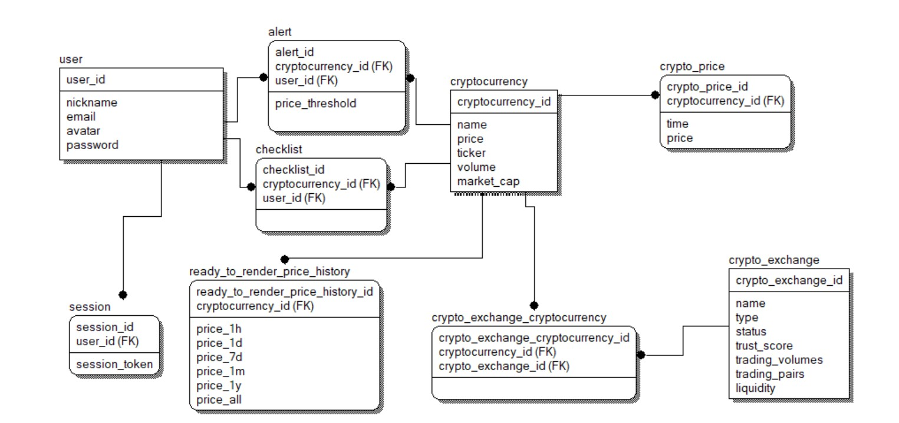

# Highload Coinmarketcap
Проект по курсу "Проектирование высоконагруженных систем" VK Education в МГТУ.

## 1. Тема и целевая аудитория 
**Coinmarketcap**  —  веб-сервис для отслеживания цен на криптовалютные активы.

### Ключевой функционал (MVP)
- Получение актуальных данных о ценах на криптовалюты
- Получение ранжированного списка криптовалют
- Получение исторических данных
- Получение уведомлений о достижении цены определённых значений
- Получение ранжированного списка криптобирж
- Получение аналитических данных

### Целевая аудитория
Веб-сервис имеет около 80 миллионов активных пользователей в месяц.
Данные о месячной аудитории по странам представлены в таблице.

| Страна    | Количество пользователей в месяц, млн |
| --------- | ------------------------------------- |
| США       | 22,26                                 |
| Бразилия  | 8,84                                  |
| Германия  | 8,31                                  |
| Индия     | 7,85                                  |
| Индонезия | 5,77                                  |

## 2. Расчет нагрузки

### Продуктовые метрики

По данным сайта [hypestat](https://hypestat.com/info/coinmarketcap.com) 

* Дневная аудитория(DAU) - 2.8 млн
* Месячная аудитория(MAU) - 85.2 млн

### Объем сохраняемых данных

В открытых источниках нет информации, сколько всего пользователей зарегистрировано в CoinmarketCap.
Но всего по данным на 2023 год владельцами криптовалют (то есть наиболее вероятными пользователями сервиса) являются 580 млн. человек.   Далеко не каждый из этих 580 млн. использует именно CoinmarketCap для отслеживания цен на криптовалюты.
Также стоит отметить, что даже незарегистрированным пользователям доступен практически полный функционал веб-сервиса. Регистрация по большей части нужна только наиболее активным пользователям криптовалют, которые совершаю достаточно много сделок, пытаясь спекулировать на цене, потому что регистрация даёт возможность получаения уведомлений об изменении цены. 
Из открытых источников мне не удалось узначать, какой процент пользователей заходит просто посмотреть на цену, а какой ещё и выставляет уведомления об изменении цен.
Поэтому в своих расчётах я буду опираться на свою экспертность в данном вопросе и возьму цифру в 50 млн зарегистрированных пользователей:

| хранимые данные           | средний размер         |  суммарный объем |
|---------------------------|------------------------|------------------|
| профиль пользователя      | 5  Кб                  |   250 Гб         | 

В профиль пользователя входят:
* Базовые данные профиля (имя, email, пароль, дата регистрации, соцсети, 2FA и т.д.)
* Перечать отслеживаемых криптовалют (уведомления об изменениии цены, хранение списка отслеживаемых криптовалют)

### Запросы пользователей в день и RPS

В открытых источниках мне не удалось найти данные о количестве различных действий пользователя в день. Поэтому я использовал данные сайта [hypestat](https://hypestat.com/info/coinmarketcap.com), согласно которым в день посещается 7 679 805 страниц или 2.73 страницы на пользователя в день

Предположительные данные по среднему количеству запросов пользователя представлены в таблице ниже. RPS можно вычислить по формуле: RPS = среднее_кол-во_действий_в_день * DAU / 86400

Я предполагаю, что пиковый RPS привязан к определённым событиям в криптомире и составляет до х100 от среднего
Для такого коэффициента существуют следующие обоснования:
1. Цена абсолютного большинства криптовалют в большей или меньшей степени кореллируют с биткоином. Биткоин в свою очередь коррелирует с фондовым рынком. 
2. Если посмотреть на исторические данные, то можно заметить, что на цену криптовалют влияют следующие факторы: денежно-кредитная политика, экономическая ситуация, геополитика, изменения в регулировании.

Из пунктов 1 и 2 следует, во-первых, что криптовалюты либо растут либо падают относительно синхронно, а, во-вторых, что это падение зачастую привязано к новостям по определённым темам. Соответственно в момент выхода таких новостей и будет наступать пиковый RPS за счёт того, что пользователи пойдут смотреть на цены, а также сервис начнёт отправлять уведомления большому числу пользователей.

| посещаемые страницы                               | среднее количество в день на пользователя | средний RPS  | пиковый RPS |
|---------------------------------------------------|:-----------------------------------------:|--------------|-------------|
| посещение главной страницы                        |                   1                       | 32           |  3200       |
| посещение страницы отдельно взятой криптовалюты   |                   1.7                     | 55           |  5500       |
| получение ранжированного списка криптобирж        |                   0.03                    | 1            |  100        |
| **Всего**                                         |                  **2.73**                 | **88**       |  **8800**   |

| действия на странице                              | среднее количество в день на пользователя | средний RPS  | пиковый RPS |
|---------------------------------------------------|:-----------------------------------------:|--------------|-------------|
| добавление в избранное \ удаление из избранного   |                   0.1                     | 3            |  300        |
| подписка на уведомлени \ отписка от уведомлений   |                   0.1                     | 3            |  300        |
| получение исторических данных                     |                   5                       | 162          |  16 200     |
| **Всего**                                         |                  **5.2**                  | **168**      |  **16 800** |

| websocket                                         | среднее количество в день на пользователя | средний RPS  | пиковый RPS   |
|---------------------------------------------------|:-----------------------------------------:|--------------|---------------|
| получение уведомления                             |                   10                      | 7            |  700          |
| получение изменений цены                          |                   86400                   | 56 000       |  1 400 000    |
| **Всего**                                         |                  **86410**                | **56 007**   | **1 400 700** |

Я исхожу из предположения, что только каждый 50-ый пользователь держит длительное время страницу открытой. Также стоит принимать во внимание, что подобного рода сервисы используют определеённую оптимизацию, переодически проверяя активность пользователя на странице. И если пользователь не пользуется страницей. То передача сообщений через Websocket приостонавливается, а возобновляется только в тот момент, когда пользователь вновь проявляет активность.  То есть только с 2% пользователей нужно единовременно держать активный Websocket - то есть с 140 тыс. пользователями.   Сообщения через web-socket отправляются в среднем ~60 раз в минуту. 
Я предполагаю, что в моменты пиковой нагрузки сообщения через websocket начинаю передаваться в несколько раз реже, например, в 4 раза реже.

### Сетевой трафик

Нагрузку на сеть можно расчитать по формуле: нагрузка[Гбит/c] = средний_трафик_на_действие * RPS * 8 / 1024 

| посещаемые страницы                              | средний трафик на одно действие | средняя нагрузка на сеть | пиковая нагрузка на сеть |
|--------------------------------------------------|---------------------------------|--------------------------|--------------------------|
| посещение главной страницы                       | 36.7 Кб                         | 9.2 Мбит/с               |  0.9 Гбит/с           |
| посещение страницы отдельно взятой криптовалюты  | 64.4 Кб                         | 16.1 Мбит/с              |  1.57 Гбит/c           |
| получение ранжированного списка криптобирж       | 22.2 Кб                         | 5.57 Мбит/с              |  0.54 Гбит/c              |
| **Всего**                                        |                                 | **30.9 Мбит/c**          |  **3.01 Гбит/c**       |

| действия на странице                              | средний трафик на одно действие           | средняя нагрузка на сеть  | пиковая нагрузка на сеть |
|---------------------------------------------------|:-----------------------------------------:|---------------------------|--------------------------|
| добавление в избранное \ удаление из избранного   |                   1 Кб                    | 24 Кбит/с                 |  2.34 Мбит/с             |
| подписка на уведомлени \ отписка от уведомлений   |                   1 Кб                    | 24 Кбит/с                 |  2.34 Мбит/с             |
| получение исторических данных                     |                   30 Кб                   | 720 Кбит/с                |  70.31 Мбит/с            |
| **Всего**                                         |                                           | **768 Кбит/с**            |  **75 Мбит/с**           |

| websocket                                         | средний трафик на одно действие           | средняя нагрузка на сеть  | пиковая нагрузка на сеть |
|---------------------------------------------------|:-----------------------------------------:|---------------------------|--------------------------|
| получение уведомления                             |                   1.6 Кб                  | 89.6 Кбит/с               |  8.75 Мбит/с             |
| получение изменений цены                          |                   0.4 Кб                  | 175 Мбит/с                |  17.1 Гбит/c             |
| **Всего**                                         |                                           | **175.01 Мбит/с**         | **17.1 Гбит/c**          |

Браузер не даёт посмотреть конкретные значения трафика, пересылаемые через WebSocket, но даёт посмотреть длину сообщения.
Берём вес одного символа в 1 байта. Среднее сообщение в 410 символов. Среднее число сообщений в минуту - 60.
Получается 24 Кб в минуту.

## 3. Глобальная балансировка нагрузки

### Обоснования расположения ЦОДов

В пункте [1. Тема и целевая аудитория](#1-тема-и-целевая-аудитория) приводилось географическое распределение аудитории CoinMarketCap.   При размещении ЦОДов также будем учитывать, что пиковая нагрузка может быть до 100 раз больше средней.

18-23% аудитории - это США и Канада, что в райно 25 млн MAU, поэтому в Северной Америке необходимо расположить несколько ЦОДов в городах с самым большим населением, которые будут распределены по площади страны. Также на США лучше не эконимать, поэтому лучше поставить ЦОДы поплотнее:

В Бразилии находится около 6-9% аудитории, что составляет ~9 млн. MAU. Несмотря на большую площадь страны, для начала достаточно разместить там 1 ЦОД на побережье Антлантики, поскольку всё население сосредоточено именно там, а население в Южной Америке не столь богатое, чтобы ставить ещё ЦОДы, так что задержка для них будет приемлемая:

32-37% аудитории - это Европа и прилегающие страны, что в райно 40 млн MAU. Население здесь тоже достаточно обеспеченное, и присутствует необходимая инфраструктура, так что можно поставить побольше ЦОД:

7% аудитории - это Корея и Япония. Данные страны относятся к развитыми, соответсвенно на них тоже не стоить экономить, и лучше поставитьв каждой по ЦОД. Также на всякий случай можно поставить ЦОД в Шанхае, чтобы перенаправлять туда китайских пользователей, обходящих местные блокировки.

Криптовалюты пользуются большой популятностью в Юго-Восточной Азии. Около 18% пользователей сервиса отсюда. И хоть население здесь весьма бедное, но этот регион является быстроразвивающимся, а как следствие перспективным. Так что можно поставить в нём несколько ЦОД. 
Также можно поставить небольшой ЦОД в Австралии, чтобы покрывать пользователей относящихся к региону "Австралия и Океания", тем более, что на Австралию с Новой Зеландией приходится порядка 3% MAU.

Ситуация аналогичная Юго-Восточной Азии сейчас в Центральной африке. Только по известной информации в Нигерии около 4% пользователей сервиса. Скорее всего с учётом всех соседних стран эта цифра может увеличиться до 10%. Также данный регион является быстроразвивающимся и перспективным, поэтому имеет смысл поставить здесь как минимум 1 ЦОД.

Также имеет смысл поставить 1 ЦОД в Дубаи. Чтобы покрыть пользователей из стран арабского мира. Только в одном Иране находится 4% пользователей сервиса.

Итоговая карта:

### Расчет распределения запросов по ЦОДам

Суммарно имеем 18 ЦОДов на 2.8 млн DAU.

В идеале каждый ЦОД должен: 
- обслуживать одинаковое среднее количество DAU: 2 800 000 / 18 = 156 000
- получать одинаковое среднее количество обычных RPS: 256 / 18 = 14
- отправлять одинаковое среднее количество WebSocket RPS: 56 000 / 18 = 3 100

С учетом того, что по факту на какие-то ЦОДы может ходить в 2 раза больше пользователей из-за их неравномерного распределения, а также с учетом пиковой нагрузки х100 от средней, имеем пиковую нагрузку на ЦОД:
 - по обычным запросам 14 * 2 * 100 = 2 800 RPS.
 - по WebSocket запросам 3100 * 2 * 15 = 93 000 RPS.

### DNS-балансировка

Для балансировки нагрузки по регионам будем использовать Latency-based DNS. Это означает, что запросы пользователей будут обрабатываться тем ЦОДом, до которого latency минимальна (скорее всего, это будет ближайший географически ЦОД).

### CDN

Для снижения времени загрузки страниц и контента будем использовать CDN: контент может быть кэширован на серверах, распределенных географически, и пользователь будет получать контент с ближайшего.

## 4. Локальная балансировка нагрузки

### Схема балансировки для входящих и межсервисных запросов

- Nginx будет работать как HTTP Reverse Proxy балансировщик на уровне L7 для входящих запросов.
- Sticky sessions: Для распределения нагрузки балансировщик будет направлять все последующие WebSocket-запросы от одного пользователя на один и тот же сервер. Это позволяет сохранять состояние сессии на одном сервере.
- Алгоритм Least Connections обеспечивает равномерное распределение нагрузки между бэкендами.
- Kubernetes будет использоваться для распределения межсервинаых запросов в зависимости от состояния конкретного пода.

### Схема отказоустойчивости

Для повышения устойчивости системы будут применяться Kubernetes и  технологии автоматического масштабирования (Auto-scaling). Эти инструменты позволяют эффективно реализовать функцию обнаружения новых сервисов (Service Discovery) через процесс оркестрации.

Система управления контейнерами играет ключевую роль в этом процессе:
- При запуске нового контейнера, система автоматически регистрирует его в реестре сервисов после успешного прохождения теста готовности (readiness probe).
- Тесты готовности также используются для мониторинга состояния работающих подов (pods). Если какой-либо под не проходит этот тест, система автоматически исключает его из кластера.

Такой подход обеспечивает непрерывную доступность сервисов и автоматическое восстановление системы в случае сбоя отдельных компонентов.

### Нагрузка по терминации SSL

Для оптимизации процесса повторной идентификации пользователей веб-сервиса используется механизм session tickets:
- При начальном взаимодействии пользователя с веб-сервисом выполняется стандартная процедура TLS-рукопожатия. В рамках этого процесса сервер создает уникальный session ticket и передает его клиентскому устройству.
- В ходе последующих обращений пользователь может представить этот session ticket сервису. Используя эту информацию, система восстанавливает параметры предыдущей сессии, что значительно сокращает время обработки запроса.
- Применение session tickets позволяет уменьшить количество полноценных TLS-рукопожатий, тем самым снижая нагрузку на сервер. Хранение этих тикетов обычно осуществляется локально на стороне клиента, например, в виде файлов cookie.

Безопасность на транспортном уровне должна быть обеспечена как для внешних запросов, так и внутри самой сети. С этой целью терминация SSL будет реализована на уровне каждой отдельной единицы микросервисной архитектуры. Такой подход позволяет тщательно контролировать все входящие и исходящие соединения, гарантируя надежную защиту данных на протяжении всего кластера.

## 5. Логическая схема БД

| Таблица           | Описание                                                                                                                                              |
|-------------------|-------------------------------------------------------------------------------------------------------------------------------------------------------|
| user              | user хранит данные пользователей, такие как email, username, хэш пароля и т.д.                                                                        |
| cryptocurrency    | cryptocurrency хранит данные о криптовалютах. Хранится название, текущая цена, тикер, торговый объём, капитализация и т.д .                       |
| alert             | alert хранит информацию об оповещениях, которые установили пользователи. Хранится порог цены, при котором необходимо производить оповещение.  |                                                    
| checklist         | checklist хранит список отслеживаемых пользователем криптовалют |
| crypto_price      | crypto_price хранит историю цен криптовалют. Хранится время и цена |
| session           | session хранит сессии пользователей. Хранится токен сессии|
| ready_to_render_price_history | ready_to_render_price_history хранит историю изменения цен в виде, не требующем дальнейшей обработки перед рендерингом. Хранятся данные для отображения за промежутки 1ч, 1д, 1н, 1м, 1г и все время наблюдения |
| crypto_exchange | crypto_exchange хранит информацию о криптобержах. Хранится название, тип, статус, рейтинг доверия и т.д. |
| crypto_exchange_cryptocurrency | crypto_exchange_cryptocurrency хранит информацию о том, какие криптовалюты представлены на каких биржах |

### Типы и размер данных

#### user
 - user_id - BIGINT (8 байт)
 - nickname - TEXT (30 байт)
 - email - TEXT (320 байт)
 - password_hash - TEXT (256 байт)
 - avatar - TEXT (16 байт)

 Итого: 650 байт на одного пользователя без учета аватара 

 Суммарный объем данных: 650 байт * 2,7 млрд. пользователей = 30,3 Гб

 #### cryptocurrency
 - сryptocurrency_id - BIGINT (8 байт)
 - name - TEXT (16 байт)
 - ticker - TEXT (16 байт)
 - price - BIGINT (8 байт)
 - volume - BIGINT (8 байт)
 - market_cap - BIGINT (8 байт)

 Также данная сущность имеет атрибуты второстепенной важности. Это приблизительно 15 числовых полей для технической, статической и аналитической информации, каждое поле типа BIGINT (8 байт)
 К этим полям относятся: максимальное предложение, максимальная цена за всё время, мнимальная цена за всё время, рыночная капитализация при 100% эмиссии, циркулирующее предложение, рейтинг, рыночное доминирование и т.д.

Итого: 200 байт на одну криптовалюту без учёта иконки

Суммарный объем данных: 200 байт * 13 200 отслеживаемых криптовалют = 2,51 Мб

#### crypto_exchange
Считаю нецелесообразным обсчёт кадого конкретного поля в записи криптобиржи. Потому что их всего 500
И в худшем случае это будет несколько сотен мегабайт, а учитывая подробный разбор сущности cryptocurrency, реальный размер будет всего несколько Мб

#### checklist
 - id - BIGINT (8 байт)
 - cryptocurrency_id - BIGINT (8 байт)
 - user_id - BIGINT (8 байт)

Итого: 24 байта на одну запись в таблице отслеживаемых криптовалют

Примем, что один пользователь в среднем имеет в своём списке отслеживания 10 криптовалют

Суммарный объем данных: 24 байта * 10 * 50 млн. польз. = 11,2 Гб

#### alert
 - id - BIGINT (8 байт)
 - cryptocurrency_id - BIGINT (8 байт)
 - user_id - BIGINT (8 байт)
 - price_threshold - BIGINT (8 байт)

Итого: 32 байта на одно оповещение

Примем, что один пользователь в среднем имеет 5 активных оповещений

Суммарный объем данных: 32 байта * 5 * 50 млн. польз. = 7.4 Гб

#### crypto_price
 - crypto_price_id - BIGINT (8 байт)
 - cryptocurrency_id - BIGINT (8 байт)
 - time - TIMESTAMP (8 байт)
 - price - BIGINT (8 байт)

Итого: 32 байта на один запись

Сервис отслеживает 13 200 отслеживаемых криптовалют
С среднем данные о цене обновляются раз в 10 секунд. Хотя для наиболее популярных криптовалют задержка может быть меньше, а для непопулярных - больше
Криптовалютный бум (когда резко увеличилось количество криптовалют) случился в 2017 году. Соответственно примем, что данные о ценах, составляющие наибольшую объёмную нагрузку на базу, находятся в промежутке с 2017 по 2024 год
Также я полагаю, что не имеет смысл хранить посекундные цены для данных старше одного года.
Таким образом получается что за 1 год нужно хранить посекундные данные и дневные цены за последующие 6 лет.

32 байта * 13 200 отслеживаемых криптовалют * 3 153 600 = 1,2 Тб для хранения посекундных цен за последний год

32 байта * 13 200 отслеживаемых криптовалют * 365  = 147 Мб для хранения дневных цен за последние 6 лет

Суммарный объем данных: 1,2 Тб

### Нагрузка на чтение/запись
Исходя из данных по RPS (запросы в секунду) и средней активности пользователей (см. предыдущие пункты):

#### Чтение:
Основная нагрузка на чтение приходится на просмотр главной страницы (3 200 RPS в пиковые моменты) и просмотр отдельно взятой страницы криптовалюты (5 500 RPS в пиковые моменты).
Следовательно кеширование популярных страниц криптовалют, а также главной страницы может существенно снизить нагрузку на базу данных.

#### Запись:
Основная нагрузка на запись связана с добавлением в список отслеживаемым криптовалют (3 RPS), установкой уведомлений (3 RPS), обновлением цены криптовалют (1 320 RPS).

### Требования консистентности:
- Уникальность ключей: Все поля, являющиеся ключами в таблицах (user_id, alert_id, cryptocurrency_id и т.д.), должны быть уникальными.
- Пользователи: При удалении пользователя необходимо удалить все связанные данные (оповещения и списки отслеживания).
- Цена криптовалют: при поступлении новых данных из внешних источников требуется незамедлительное обновление.
- второстепенные поля криптовалюты: Могут работать с более слабой консистентностью, обновления могут происходить с достаточно большой задержкой

### Кеширование и буферы
- Данные для рендеринга графиков исторических данных: Необходимо для того, чтобы при каждом запросе не просчитывать эти данные на лету, и не совершать запросы в основные хранилище исторических данных.
- Сессии пользователей: Могут храниться в Redis с автоматическим удалением по истечении срока действия токена.

## 6. Физическая схема БД

### Выбор СУБД

Для хранения таблиц *user*, *cryptocurrency*, *alert*, *checklist*, *crypto_price*, *crypto_exchange*, *crypto_exchange_cryptocurrency* будем использовать реляционную СУБД PostgreSQL, так как нагрузка на запись для данных таблиц является небольшой, а нагрузку на чтение можно уменьшить посредством масштабирования и шардирования БД.

Для таблицы *crypto_price* будет произведено построение гипертаблицы TimescaleDB для оптимизации времени работы с временными рядами.

Для хранения данных пользовательских сессий, а также предобработанных данных для рендеринга графиков будем использовать СУБД Redis. Она позволит осуществлять быстрый доступ к данным за счёт хранения их в оперативной памяти. Отказоустойчивость будет обеспечиваться за счет встроенной поддержки репликации.

### Денормализация

- *price* в таблице *cryptocurrency* для хранения актуальной цены. Для того, чтобы каждый раз не вычислять текущую цену, как *price* последней записи из таблицы *crypto_price*

- *price_1h*, *price_1d*, *price_1m*, *price_1y*, *price_all* из таблицы *ready_to_render_price_history* хранят json-подобные структуры с готовыми для рендеринга графиков данными (нарушается свойство атомарности)

### Индексы

__таблица cryptocurrency__
- индекс на поле *name* для быстрого поиска по имени
- индекс на поле *ticker* для быстрого поиска по тикеру

__таблица alert__
- индекс на *(cryptocurrency_id, price_threshold)*. Подразумевается, что будет производиться поиск уведомлений для конкретной криптовалюты, превышающие определённый price_threshold
таким образом будут ускорены запросы вида: `SELECT * FROM Alert WHERE cryptocurrency_id = ? AND price_threshold >= ?`

__таблица checklist__
- индекс на *user_id*. Таким образом будет ускорен поиск всех криптовалют в из отслеживаемого списка для конкретного пользователя

### Шардирование и резервирование СУБД

#### PostgreSQL
Применим шардирование для таблиц user, alert, checklist, crypto_price. Распределять по шардам будем на основе первичного ключа для user, на основе внешнего ключа cryptocurrency_id для таблицы alert, на основе внешнего ключа user_id для таблицы checklist и на основе внешнего ключа cryptocurrency_id для таблицы crypto_price. Используем при этом следующий алгоритм:

- Вычисляем хеш от необходимого ключа
- Определяем по нему номера шарда, как остаток деления хеша на число шардов
- Производим операцию по номеру нужного шарда
- Будем применять репликацию по схеме master-slave с использованием нескольких синхронных slave-узлов. Такая схема поможет сохранить данные в случае отказа master-сервера. Репликация будет производиться для таблицы crypto_price, так как в ней хранятся наиболее важные для работы сервиса данные.

#### Redis
Для настройки шардирования воспользуемся встроенным механизмом Redis Cluster, который по ключу определяет шард, на котором хранятся конкретные данные.

Будем применять репликацию по схеме master-slave с использованием двух асинхронных slave-узлов. Данная схема позволит прочитать данные даже в случае отказа одного из slave-узлов.

### Клиентские библиотеки/интеграции

Backend сервиса будет написан на языке Go. Будут использоваться следующие модули для взаимодействия с базами данных:

- для PostgreSQL: [jackc/pgx/v5](https://github.com/jackc/pgx) - интерфейс для взаимодействия
- для Redis: [redis/go-redis/v9](https://github.com/redis/go-redis) - официальный интерфейс

### Балансировка запросов / мультиплексирование подключений

Для эффективной обработки запросов к PostgreSQL мы будем применять PgBouncer, который обеспечит распределение нагрузки между несколькими соединениями.

Для повышения масштабируемости и отказоустойчивости Redis мы реализуем кластеризацию с помощью Redis Cluster

### Схема резервного копирования

Для PostgreSQL мы разработаем систему резервного копирования на основе журнала предзаписи (WAL). Такой подход позволит нам создавать резервные копии "на лету", не прерывая работу сервера, и восстанавливать базу данных до любого момента времени.

Аналогичный принцип будет применен и для Redis. Мы воспользуемся механизмом Append Only File (AOF), который работает подобно WAL в PostgreSQL. Это даст возможность создавать резервные копии без простоев системы и восстанавливать состояние базы данных на любой нужный момент.

## 7. Алгоритмы

### 7.1 Алгоритм агрегирования данных

Агрегация данных из множества источников, как это делает CoinMarketCap, требует выстраивания надежного, точного и быстрого алгоритма, который сможет принимать данные от разных бирж и источников и преобразовывать их в унифицированные метрики. Вот текстовое описание возможного алгоритма такого рода:

#### Шаг 1. Подключение к источникам данных
<u>Инициализация подключений:</u> Устанавливаются API-подключения к биржам и поставщикам данных. Это может включать как публичные API, так и приватные API, предоставляющие доступ к ценам, объемам торгов, данным по ордерам, капитализации и прочему.
<u>Регулярный сбор данных:</u> Для актуальности данных сервис должен регулярно запрашивать обновления от всех подключённых источников. Этот процесс следует автоматизировать через cron-задачи или с использованием очередей (например, RabbitMQ), которые триггерят запросы с нужной периодичностью.

#### Шаг 2. Предобработка данных
<u>Очистка данных:</u> На этом этапе отбрасываются подозрительные или некорректные данные, такие как экстремальные значения цен или объёмов, значительные отклонения от медианы и прочее. Это нужно для того, чтобы аномалии на одной бирже не исказили общую картину.
<u>Конвертация валют:</u> Для каждой криптовалюты цены на разных биржах могут быть представлены в разных валютах (BTC, ETH, SOL и пр.). Поэтому данные конвертируются в одну стандартную валюту, например, в USDT.
<u>Синхронизация временных меток:</u> Чтобы данные из разных источников можно было корректно агрегировать, их необходимо синхронизировать по времени. Для этого используется единая временная метка (чаще всего UTC).

#### Шаг 3. Вычисление средневзвешенной цены
<u>Взвешенная цена по объему (VWAP):</u> Основной метрикой цены обычно является взвешенная средняя цена, которая рассчитывается на основе цены и объема на каждой бирже. Это позволяет учесть более значимые данные с больших бирж и минимизировать влияние данных с низкой ликвидностью.

\[
\text{VWAP} = \frac{\sum (\text{Price}_i \times \text{Volume}_i)}{\sum \text{Volume}_i}
\]

где:
- \(\text{Price}_i\) — цена на бирже \(i\),
- \(\text{Volume}_i\) — объем торгов для этой цены на той же бирже. Это позволяет получить общую цену, в которой учтены объемы торгов на каждой платформе.
Отсев аномальных данных: Если для какой-то биржи VWAP значительно отличается от VWAP по всем остальным биржам, она может быть отброшена из расчёта. Это защищает от манипуляций и ошибок в данных отдельных источников.

#### Шаг 4. Агрегация объемов и рыночной капитализации
<u>Объем торгов:</u> Суммируется объем торгов по каждой бирже для выбранной криптовалюты. Этот показатель дает общее представление о ликвидности и интересе к активу.
<u>Рыночная капитализация:</u> Рассчитывается по формуле:

\[
\text{Market Cap} = \text{VWAP} \times \text{Circulating Supply}
\]

где:
- \(\text{Circulating Supply}\) — актуальный объём криптовалюты в обращении. Этот параметр обычно берется из блокчейна или других надежных источников, а не бирж, так как он должен быть един и не зависит от торгов.

#### Шаг 5. Кэширование 
<u>Кэширование результатов:</u> После расчёта итоговые данные (цена, объемы торгов, капитализация) сохраняются в кэше (например, Redis) для быстрого доступа. Это позволяет серверам быстро обслуживать запросы, не пересчитывая каждый раз показатели с нуля.

### 7.2 Описание алгоритма ранжирования криптовалют
CoinMarketCap предоставляет пользователям список криптовалют, отсортированных по различным показателям, таким как рыночная капитализация, объем торгов, ликвидность и другие. Чтобы корректно ранжировать криптовалюты и помочь пользователям ориентироваться в их популярности и ценности, используется алгоритм, который учитывает несколько факторов при составлении рейтинга.

#### Шаг 1. Определение ключевых метрик
<u>Рыночная капитализация (Market Cap):</u> Основная метрика для ранжирования, вычисляется как произведение текущей цены на объем криптовалюты в обращении.
<u>Ликвидность:</u> Метрика, которая показывает, насколько легко криптовалюта может быть куплена или продана на рынке без значительного влияния на её цену. Высокая ликвидность обычно свидетельствует о высоком интересе к активу со стороны трейдеров.
Объем торгов за последние 24 часа: Эта метрика отражает общий интерес к активу и показывает его активность на рынке.

#### Шаг 2. Нормализация данных
Для более корректного сравнения между криптовалютами данные нормализуются. Например, ликвидность или объем торгов могут нормализоваться по значению максимума и минимума для каждой криптовалюты в выбранном временном интервале.
Это позволяет нивелировать влияние резких скачков или падений для криптовалют с низкой ликвидностью и объёмом торгов.

#### Шаг 3. Вычисление композитного рейтинга
<u>Взвешенное ранжирование:</u> Для каждой криптовалюты рассчитывается общий рейтинг, который представляет собой взвешенную сумму нормализованных значений ключевых метрик:

\[
\text{Rating}_i = w_1 \cdot \text{Market Cap}_i + w_2 \cdot \text{Liquidity}_i + w_3 \cdot \text{Volume}_i
\]

где:
- \(\text{Rating}_i\) — итоговый рейтинг криптовалюты \(i\),
- \(\text{Market Cap}_i\) — нормализованная рыночная капитализация,
- \(\text{Liquidity}_i\) — нормализованная ликвидность,
- \(\text{Volume}_i\) — нормализованный объем торгов,
- \(w_1\), \(w_2\), и \(w_3\) — веса для каждой метрики, которые настраиваются в зависимости от значимости.

#### Шаг 4. Корректировка весов
<u>Динамическое обновление весов:</u> В зависимости от рыночной ситуации веса могут динамически изменяться. Например, в период высокой волатильности вес ликвидности можно повысить, чтобы выделить криптовалюты с наибольшей устойчивостью.
Веса настраиваются командой аналитиков, а их обновление может происходить автоматически по заданным правилам.

#### Шаг 5. Коррекция и отсеивание некорректных данных
Чтобы избежать ситуаций, когда криптовалюты с низкой ликвидностью, но высокими кратковременными объёмами торгов поднимаются слишком высоко в рейтинге, в алгоритм добавляются корректировки. Например, криптовалюты, торгуемые на ограниченном числе бирж или с низким объёмом торгов, могут получать штрафные баллы.

### 7.3 Алгоритм скользящего окна для обновления данных [7]

Алгоритмы позволяют избежать полного пересчета данных за каждую минуту, час, день или любой другой промежуток времени, ограничиваясь минимальными вычислениями. Метод скользящего окна позволяет улучшить вычислительную сложность до линейной, а по памяти — до константной.

#### Шаг 1. Инициализация окна:
Данные хранятся в массиве фиксированной длины, например, с минутными агрегатами за последние 60 минут (или другой интервал, который необходим в конкретном случае). Это называется окно. Также хранится текущая сумма, объем или другая метрика, которая потребуется для расчёта средней цены, объема торгов и т.д.

#### Шаг 2. Добавление нового значения и удаление старого:
Когда поступает новое значение (например, обновление цены за текущую минуту), алгоритм выполняет следующие шаги:
- Удаляет старое значение (то, что вышло за пределы окна), чтобы освободить место.
- Добавляет новое значение к сумме, объему или другой метрике.
- Обновляет окно, добавив новое значение и удалив самое старое.

#### Шаг 3. Скользящий расчет средних значений:
Для расчета средней цены или других агрегатов (например, объема торгов) используйте обновлённые данные без полного пересчета.
Например, если есть текущая сумма цен за 60 минут и нужно получить новую сумму, то вычитается значение, удалённое из окна, и добавляется новое.

## 8. Технологии

<table>
	<thead>
		<tr>
			<th>Технология</th>
			<th>Тип</th>
			<th>Область применения</th>
            <th>Обоснование</th>
		</tr>
	</thead>
	<tbody>
		<tr>
			<td>TypeScript</td>
			<td>Язык программирования</td>
			<td>Frontend</td>
            <td>JavaScript со статической типизацией.
			</td>
		</tr>
		<tr>
			<td>React</td>
			<td>Библиотека</td>
			<td>Frontend</td>
            <td>JavaScript-фреймворк для создания пользовательских интерфейсов, который позволяет разделить логику и представление приложения, используя концепцию компонентов и состояний. 
			</td>
		</tr>
		<tr>
			<td>Webpack</td>
			<td>Cборщик модулей</td>
			<td>Frontend</td>
            <td>Webpack принимает зависимости и генерирует граф зависимостей, позволяющий веб-разработчикам использовать модульный подход для разработки своих веб-приложений.
			</td>
		</tr>
		<tr>
			<td>Kotlin</td>
			<td>Язык программирования</td>
			<td>Мобильное приложение (Android)</td>
            <td>Нативная разработка мобильных приложений под Android. 
			</td>
		</tr>
		<tr>
			<td>Swift</td>
			<td>Язык программирования</td>
			<td>Мобильное приложение (IOS)</td>
            <td>Нативная разработка мобильных приложений под IOS. 
			</td>
		</tr>
		<tr>
			<td>Go (Golang)</td>
			<td>Язык программирования</td>
			<td>Backend</td>
            <td>Go имеет низкий порог входа для разработчиков. Он является компилируемым и многопоточным языком, что дает высокую производительность приложений. Хорошо подходит для микросервисной архитектуры. Имеет общирную стандартную библиотеку для работы с сетью и богатую экосистему библиотек и фреймворков.
			</td>
		</tr>
		<tr>
			<td>gRPC</td>
			<td>Система (протокол)</td>
			<td>Backend</td>
            <td>gRPC использует протокол HTTP/2, который позволяет передавать множество запросов через одну TCP-соединение, что значительно улучшает производительность по сравнению с REST API. Использует Protocol Buffers для сиреализации сообщений. Поддерживается широкий спектр языков программирования, что упрощает интеграцию в распределенных системах. gRPC предоставляет инструменты для автоматической генерации клиентского и серверного кода на основе определения API.
			</td>
		</tr>
		<tr>
			<td>Protocol Buffers</td>
			<td>Протокол сиреализации данных</td>
			<td>Backend</td>
            <td>Для организации взаимодейстаия через gRPC. Сериализованные данные занимают меньше места по сравнению с JSON или XML. Протокол может быть расширен, добавляя новые поля к существующим сообщениям. Сериализация и десериализация данных происходит быстро. Также в таком виде можно осуществлять хранение данных.
			</td>
		</tr>
		<tr>
			<td>HTTPS</td>
			<td>Протокол</td>
			<td>Взаимодействие с Клиентом</td>
            <td>Стандартный протокол обмена данными. "Защищённый" http.
			</td>
		</tr>
		<tr>
			<td>WSS</td>
			<td>Протокол</td>
			<td>Взаимодействие с Клиентом</td>
            <td>"Защищённый" WebSocket. WebSocket широко поддерживается современными веб-браузерами. Поддерживает одно долговременное соединение между клиентом и сервером. Используется для обмена сообщениями и нотификации.
			</td>
		</tr>
        <tr>
			<td>PostgreSQL</td>
			<td>Реляционная СУБД</td>
			<td>Хранение пользовательских данных, а также долговременное хранение временных рядов</td>
            <td> СУБД поставляет большой функционал, высокую надежность, а также имеет расширения для шардирования и репликации.
			</td>
		</tr>
        <tr>
			<td>TimescaleDB</td>
			<td>Расширение для PostgreSQL для работы с временными рядами</td>
			<td>Оптимизационное решения для PostgreSQL при работе с временными рядами</td>
            <td> TimescaleDB оптимизирует хранение time series-данных: время вставки новых значений не увеличивается при увеличении количества данных
			</td>
		</tr>
         <tr>
			<td>Redis</td>
			<td>key-value СУБД</td>
			<td>Хранение сессий и хранение данных для диапазонов заранее агрегированых или оптимизированых для рендеринга графиков</td>
            <td> Redis - это высокая производительность и быстрый доступ к данным. Из-за чего его стоит выбрать для хранения сессий и данных для построения графиков за 1д, 1н, 1м и 1г
			</td>
		</tr>
		<tr>
			<td>Prometheus</td>
			<td>Сервис</td>
			<td>Сбор и хранение метрик</td>
            <td>Позволяет отслеживать состояние и работу систем в реальном времени. Она состоит из сервера для хранения и сбора метрик, формата данных для их представления и языка запросов PromQL для анализа и визуализации метрических данных.
			</td>
		</tr>
		<tr>
			<td>Grafana</td>
			<td>Сервис</td>
			<td>Дашборды, визуализация метрик</td>
            <td>Обеспечивает эффективный мониторинг realtime состояния сервисов, а также предоставляет гибкость при создании дашбордов.
			</td>
		</tr>
		<tr>
			<td>Nginx</td>
			<td>WebServer</td>
			<td>Прокси, балансировка</td>
            <td>Веб-сервер и реверс-прокси, используется также как балансировщик нагрузки.
			</td>
		</tr>
        <tr>
			<td>RabbitMQ</td>
			<td>Брокер сообщений</td>
			<td>Реализация очередей для целей обработки и агрегации потоков данных и обновления данных в кэшах и базах данных</td>
            <td>Обеспечивает дополнительную асинхронность и снижает зависимость между компонентами системы, при улучшении масштабируемости и производительности
			</td>
		</tr>
		<tr>
			<td>Docker</td>
			<td>Контейнеризатор</td>
			<td>Кластерезация</td>
            <td>Программная платформа для разработки, доставки и запуска контейнерных приложений. Она позволяет создавать контейнеры, автоматизировать их запуск и развёртывание, управляет жизненным циклом.
			</td>
		</tr>
		<tr>
			<td>Kubernetes</td>
			<td>Оркестратор</td>
			<td>Кластерезация</td>
            <td>Kubernetes автоматически управляет жизненным циклом контейнеров
			</td>
		</tr>
		<tr>
			<td>Vault</td>
			<td>Сервис</td>
			<td>Хранилище секретов</td>
            <td>Цифровое безопасное хранилище для защиты и управления секретами.
			</td>
		</tr>
		<tr>
			<td>GitHub</td>
			<td>Платформа</td>
			<td>Система контроля версий, CI/CD</td>
            <td>Веб-платформа для управления проектами и репозиториями программного кода. Её работа основана на системе контроля версий Git.
			</td>
		</tr>
	</tbody>
</table>

## 9. Обеспечение надежности

### Backend
Cистема будет использовать Kubernetes для создания надежной и масштабируемой backend архитектуры веб-сервиса.

__Автоматическое восстановление__
При возникновении проблем контейнеры автоматически перезапускаются, минимизируя время простоя системы.

__Оптимизация ресурсов__
Kubernetes эффективно распределяет ресурсы между узлами, обеспечивая стабильную работу даже в условиях пиковой нагрузки. Это достигается за счет равномерного распределения запросов к API.

__Поэтапное обновление сервисов__
Обновления сервисов выполняются постепенно, что позволяет избежать полной остановки системы. Такой подход гарантирует непрерывную доступность платформы для пользователей.

### Базы данных

__Репликация__
Механизм асинхронной репликации обеспечивает синхронизацию данных между несколькими географически распределенными серверами. Это позволяет быстро переключиться на резервный узел в случае неисправности основного сервера, минимизируя простои и поддерживая непрерывный доступ к данным.

__Резервированое копирование__
Регулярная автоматизация процесса создания резервных копий данных обеспечивает возможность быстрого восстановления системы после сбоев или ошибок, сводя к минимуму потери информации.

__Шардирование__
Для повышения скорости обработки запросов и улучшения масштабируемости крупные таблицы следует разбить на шарды. Это особенно эффективно для таблиц с высокой нагрузкой, где распределение данных позволяет параллельно обрабатывать множество запросов.

__Кластеризация__
Использование кластерной архитектуры баз данных обеспечивает распределение нагрузки между несколькими узлами. В случае отказа одного из узлов система автоматически перенаправляет запросы на работающие серверы, поддерживая непрерывность работы.

__Кэширование__
Для снижения нагрузки на основную базу данных и ускорения обработки часто запрашиваемых данных реализована система кэширования. Она хранит наиболее востребованную информацию в оперативной памяти, значительно ускоряя время отклика системы при повторных запросах к этим данным.

### Мониторинг работы сервиса

__Логирование__ 
Все входящие запросы и исходящие ответы сервиса подвергаются детальному логированнию. Этот подход позволяет эффективно выявлять причины потенциальных сбоев и проводить тщательный анализ инцидентов.

__Сбор метрик__
Для сбора важных показателей производительности используется система Prometheus. Она собирает широкий спектр данных, включая:

- Частоту возникновения ошибок на страницах
- Время отклика API
- Объемы входящих запросов

__Визуализация данных и мониторинг в режиме реального времени__
Собранные метрики визуализируются с помощью Grafana, что обеспечивает возможность наблюдения за состоянием системы в режиме реального времени. Это позволяет оперативно отслеживать динамику работы сервиса и выявлять потенциальные проблемы на ранних стадиях.

__Автоматическая система оповещений__
При обнаружении отклонений от нормальных значений метрик система автоматически отправляет предупреждения. Этот механизм обеспечивает быструю реакцию на сбои в работе сервиса, минимизируя время простоя и улучшая общую надежность системы.

### Прочие инструменты обеспечения надежности

__Географически распределенное размещение серверов__
Платформа развернута в нескольких центрах обработки данных, расположенных в разных регионах. Это обеспечивает:

- Непрерывность работы даже при локальных сбоях в отдельных дата-центрах
- Снижение сетевой задержки для пользователей из разных регионов
- Повышение общего качества обслуживания благодаря распределению нагрузки между несколькими узлами

__Корректная система завершения работы__
При завершении работы сервисов реализована система корректной обработки всех активных запросов. Это предотвращает потерю данных и обеспечивает надежность операций, даже если требуется перезапуск или обновление компонентов системы.

__Держурства системных администраторов__
Для обеспечения непрерывной работы системы следует назначить держурных системных администраторов, которые будут круглосуточно нести деружство. Это позволяет оперативно реагировать на любые непредвиденные ситуации, возникающие в любое время суток, и минимизировать возможные простои.

__Защита от DDOS-атак__
Реализована комплексная система защиты от атак. Она включает:

- Фильтрацию трафика на уровне сетевых устройств
- Использование специализированных сервисов для поглощения атак
- Динамическое масштабирование ресурсов в случае выявления подозрительной активности
- Постоянный мониторинг и анализ трафика для раннего обнаружения потенциальных угроз

## Источники
1. [According to CMC 2024](https://coinmarketcap.com/academy/article/according-to-cmc-2024-h1)
2. [coinmarketcap.com Trafic Analytics, Ranking & Audience August 2024](https://www.similarweb.com/website/coinmarketcap.com)
3. [coinmarketcap.com July 2024 Traffic Stats](https://www.semrush.com/website/coinmarketcap.com/overview/)
4. [Bitcoin Correlation Map](https://www.tradingview.com/script/74E9YRKI-Bitcoin-Correlation-Map/)
5. [Is There a Cryptocurrency Price Correlation to the Stock Market](https://www.investopedia.com/news/are-bitcoin-price-and-equity-markets-returns-correlated/)
6. [В 2023 году количество пользователей криптовалют в мире выросло на 34% — до 580 000 000 человек](https://dzen.ru/a/Za-LwZsN-BbkDSfq)
7. [Метод скользящего окна](https://wcademy.ru/sliding-window-method/)
8. [Time series данные в реляционной СУБД. Расширения TimescaleDB и PipelineDB для PostgreSQL](https://habr.com/ru/companies/oleg-bunin/articles/464303/)

